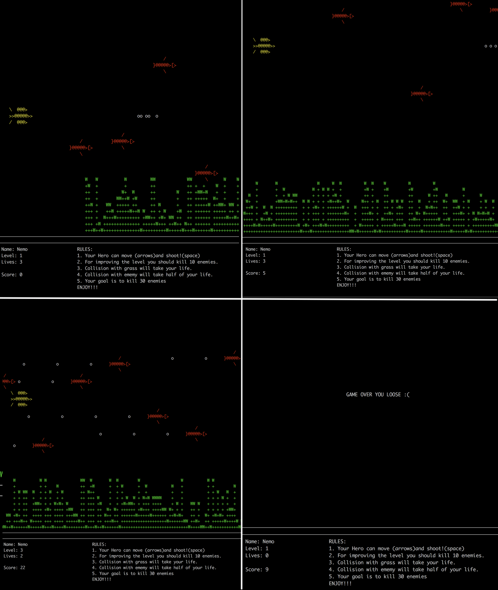

# Retro-arcade-game
It was a group project that we are given a time, less than 53 hours to write and complete a full retro arcade game in C++.\
We were given instructions to use ncurses library to make this game interactive in the terminal, and full ability to be free about the choosing idea.\
On the base of the base abstract class, we created all our game entities, the hero, enemies, bullets, and elements of the landscape.\
As a result, we created a simple and short game, with clear instructions, that we always can make more difficult.
Players will be able to engross themselves in a fun experience of how to survive the underwater world if you just a small fish!\

